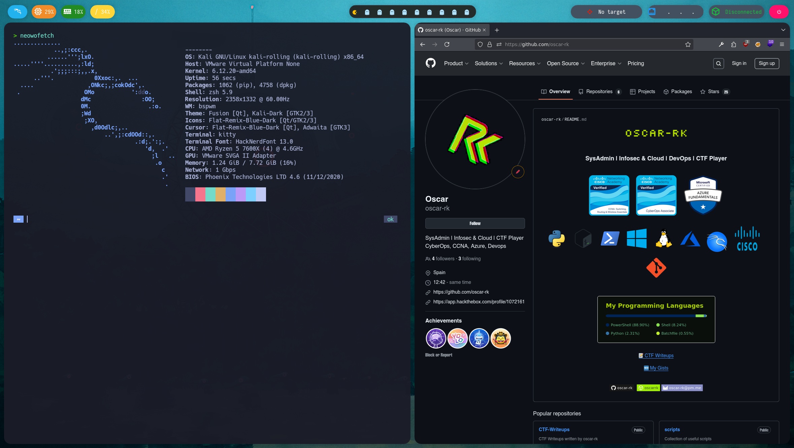

This is environment is specifically designed for pentesting

🎨 Customization / Terminal
----

Kitty – Modern, GPU-accelerated terminal emulator.

Zsh – Your shell of choice.

Powerlevel10k – A fast, feature-rich Zsh theme.

.p10k.zsh – Your Powerlevel10k config file.

.zshrc - My zsh config file

💻 Desktop Environment
---

BSPWM - Window manager

Sxhkd - Shortcut manager

Picom - Transparency manager

Rofi – Lightweight application launcher.

VSCodium - Text editor

Polybar - Customizable top bar

Custom Polybar scripts

Batcat and LSD - Console tools for advanced commands.

📁 Dotfiles added
---

.zshrc

.p10k.zsh

.fehbg (likely for managing wallpaper via feh)

Your entire ~/.config folder or subfolders (e.g., Kitty, Neovim, etc.)
